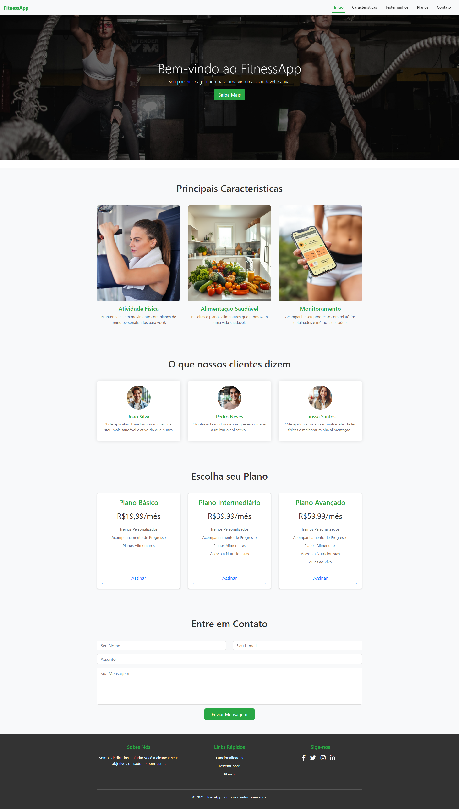

# FitnessApp



## Descrição

O **FitnessApp** é um website responsivo que oferece aos usuários uma experiência simplificada para explorar características, testemunhos e planos de uma aplicação fitness. O objetivo é criar uma interface limpa e amigável, onde os usuários podem navegar facilmente entre as seções e encontrar as informações que precisam.

## Funcionalidades

- **Navegação Responsiva:** Navbar que se adapta a diferentes tamanhos de tela, com links para as principais seções do site.
- **Scrollspy:** Destaque automático dos links na navbar conforme o usuário navega pela página.
- **Seções:** O site é dividido em seções claras e distintas: Início, Características, Testemunhos, Planos, e Contato.

## Tecnologias Utilizadas

- **HTML5:** Estrutura do site.
- **CSS3:** Estilização, incluindo Flexbox para layout e customizações responsivas.
- **JavaScript:** Manipulação dinâmica da navegação, destacando seções visíveis.
- **Bootstrap 5.3:** Framework CSS para criar um layout responsivo e componentes prontos.

## Estrutura do Projeto

```plaintext
FitnessApp/
│
├── index.html        # Página principal com estrutura HTML
├── styles.css        # Arquivo CSS customizado
├── images/           # Imagens e outros arquivos estáticos
├── screenshot.png    # Screenshot global da página
└── README.md         # Documentação do projeto
```

## Instalação

1. **Clone o repositório:**

   ```bash
   git clone https://github.com/fitness-app/fitness-app.git
2. **Navegue até o diretório do projeto:**
    ```bash
    cd fitness-app
3. **Abra o arquivo index.html em um navegador:**
4. **Ou utilize uma extensão como Live Server, caso utilize VScode.**


## Uso

O FitnessApp pode ser utilizado como um modelo para projetos que requerem uma interface limpa e moderna com navegação simples. Explore as seções do site clicando nos links da navbar ou rolando a página.

## Autor
Hening Pereira - [GitHub](https://github.com/heningdev) - [LinkedIn](https://www.linkedin.com/in/hening-dev/)
